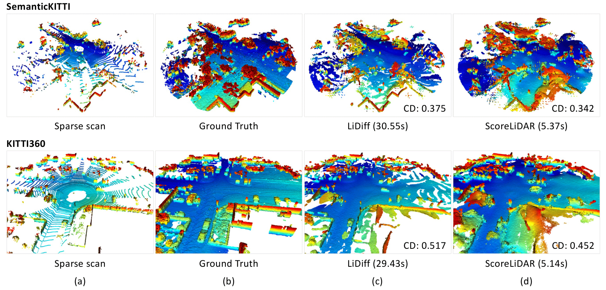

<div align="center">

# 🔥**ScoreLiDAR**🔥
## **[Distilling Diffusion Models to Efficient 3D LiDAR Scene Completion](https://arxiv.org/abs/2412.03515)**

by *[Shengyuan Zhang](https://github.com/SYZhang0805)<sup>1</sup>, An Zhao<sup>1</sup>, [Ling Yang](https://github.com/YangLing0818)<sup>2</sup>, [Zejian Li*](https://zejianli.github.io/)<sup>1</sup>, Chenye Meng<sup>1</sup>, Haoran Xu<sup>3</sup>, Tianrun Chen<sup>1</sup>, AnYang Wei<sup>3</sup>,Perry Pengyun GU<sup>3</sup>, [Lingyun Sun](https://person.zju.edu.cn/sly)<sup>1</sup>*

*<sup>1</sup>Zhejiang University <sup>2</sup>Peking University <sup>3</sup>Zhejiang Green Zhixing Technology co., ltd*



</div>

## **Abstract**

Diffusion models have been applied to 3D LiDAR scene completion due to their strong training stability and high completion quality.
However, the slow sampling speed limits the practical application of diffusion-based scene completion models since autonomous vehicles require an efficient perception of surrounding environments. 
This paper proposes a novel distillation method tailored for 3D LiDAR scene completion models, dubbed **ScoreLiDAR**, which achieves efficient yet high-quality scene completion.
ScoreLiDAR enables the distilled model to sample in significantly fewer steps after distillation.
To improve completion quality, we also introduce a novel **Structural Loss**, which encourages the distilled model to capture the geometric structure of the 3D LiDAR scene.
The loss contains a scene-wise term constraining the holistic structure and a point-wise term constraining the key landmark points and their relative configuration.
Extensive experiments demonstrate that ScoreLiDAR significantly accelerates the completion time from 30.55 to 5.37 seconds per frame ( $>$ 5 $\times$ ) on SemanticKITTI and achieves superior performance compared to state-of-the-art 3D LiDAR scene completion models.

## **Environment setup**

The following commands are tested with Python 3.8 and CUDA 11.1.

Install required packages:

`sudo apt install build-essential python3-dev libopenblas-dev`

`pip3 install -r requirements.txt`

Install [MinkowskiEngine](https://github.com/NVIDIA/MinkowskiEngine) for sparse tensor processing:

`pip3 install -U MinkowskiEngine==0.5.4 --install-option="--blas=openblas" -v --no-deps`

Setup the code on the code main directory:

`pip3 install -U -e .`

## **Inference**

First, download the models 'ScoreLiDAR_diff_net.ckpt' and 'refine_net.ckpt' from [here](https://drive.google.com/drive/folders/1f5c3BuD88TiOEuVhMq09wTQUMKwjO5lQ?usp=drive_link) and place it in the following directory: 

`checkpoints/*.ckpt`

Then run the inference script with the following command:

`python3 tools/diff_completion_pipeline.py --denoising_steps 8 --cond_weight 3.5` 

This script will read all .ply files under `scorelidar/Datasets/test/` directory as model input and the results will be saved under `scorelidar/results/`. We have provided a .ply file sample for inference.

You can visualize the result with the following command:

`python3 vis_pcd.py -p <path_to_.ply_file>`

## **Training**

We used The SemanticKITTI dataset for training.

The SemanticKITTI dataset has to be downloaded from the [official site](http://www.semantic-kitti.org/dataset.html#download) and extracted in the following structure:

```
./scorelidar/
└── Datasets/
    └── SemanticKITTI
        └── dataset
          └── sequences
            ├── 00/
            │   ├── velodyne/
            |   |       ├── 000000.bin
            |   |       ├── 000001.bin
            |   |       └── ...
            │   └── labels/
            |       ├── 000000.label
            |       ├── 000001.label
            |       └── ...
            ├── 08/ # for validation
            ├── 11/ # 11-21 for testing
            └── 21/
                └── ...
```

Ground truth scenes are not provided explicitly in SemanticKITTI. To generate the ground complete scenes you can run the `map_from_scans.py` script. This will use the dataset scans and poses to generate the sequence map to be used as ground truth during training:

```
python3 map_from_scans.py --path Datasets/SemanticKITTI/dataset/sequences/
```

We used the pre-trained model of LiDiff. Download the teacher model weights 'diff_net.ckpt' from [here](https://drive.google.com/drive/folders/1f5c3BuD88TiOEuVhMq09wTQUMKwjO5lQ?usp=drive_link) or the official release of [LiDiff](https://github.com/PRBonn/LiDiff) and place it at `checkpoints/diff_net.ckpt`.

Once the sequences map is generated and the teacher model is ready you can then train the model.

For training the model, the configurations are defined in `config/config.yaml`, and the training can be started with:

`python3 train.py`

## **Citation**

If you find our paper useful or relevant to your research, please kindly cite our papers:

```bibtex
@article{zhang2024distillingdiffusionmodels,
    title={Distilling Diffusion Models to Efficient 3D LiDAR Scene Completion}, 
    author={Shengyuan Zhang and An Zhao and Ling Yang and Zejian Li and Chenye Meng and Haoran Xu and Tianrun Chen and AnYang Wei and Perry Pengyun GU and Lingyun Sun,
    journal={arXiv:2412.03515},
    year={2024}
}
```

## **Credits**

ScoreLiDAR is highly built on the following amazing open-source projects:

[Lidiff](https://github.com/PRBonn/LiDiff): Scaling Diffusion Models to Real-World 3D LiDAR Scene Completion
